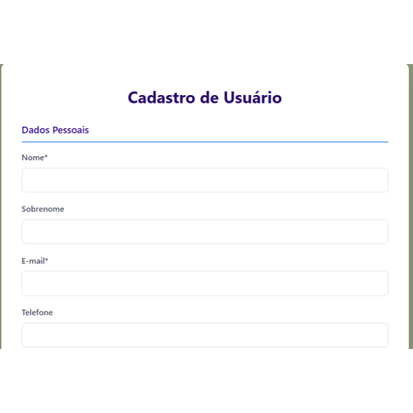

📝 README - Sistema de Cadastro de Usuários

📌 Visão Geral
Sistema completo de cadastro de usuários com validações robustas, persistência em banco de dados MySQL e interface moderna. Desenvolvido em PHP puro seguindo as melhores práticas de segurança e usabilidade.

✨ Funcionalidades Principais
Cadastro completo de usuários com dados pessoais, endereço e segurança

Validações em tempo real no servidor

Persistência dos dados entre submissões do formulário

Feedback visual claro para erros e sucessos

Proteção contra SQL Injection e XSS

Design responsivo que se adapta a diferentes telas

🛠️ Tecnologias Utilizadas
PHP 8.2+

MySQL 5.7+

HTML5 semântico

CSS3 moderno

PDO para acesso ao banco de dados

📦 Estrutura do Projeto
projeto_php/
├── assets/
│   └── css/
│       └── style.css       # Estilos principais
├── includes/
│   ├── config.php          # Configurações do banco
│   └── functions.php       # Funções utilitárias
├── index.php               # Formulário principal
├── cadastro.php            # Processamento do cadastro
└── README.md               # Este arquivo
🚀 Como Executar
Pré-requisitos:

Servidor web (Apache/Nginx)

PHP 8.2+

MySQL 5.7+

Configuração:

bash
git clone [repositório]
cd projeto_php
Banco de Dados:

Importe o arquivo database.sql para criar a estrutura necessária

Configurações:

Edite includes/config.php com suas credenciais do banco

Acesso:

Abra http://localhost/projeto_php no navegador

🔒 Validações Implementadas
Campo	Validações
Nome	Obrigatório
E-mail	Formato válido, único no sistema
Senha	Mínimo 8 caracteres
Confirmação Senha	Deve coincidir com senha
Data Nascimento	Formato válido (AAAA-MM-DD)
Idade	Entre 0 e 120 anos
📝 Licença
Este projeto está licenciado sob a licença MIT - veja o arquivo LICENSE para detalhes.

🤝 Contribuição
Contribuições são bem-vindas! Siga os passos:

Faça um fork do projeto

Crie sua branch (git checkout -b feature/nova-feature)

Commit suas mudanças (git commit -m 'Adiciona nova feature')

Push para a branch (git push origin feature/nova-feature)

Abra um Pull Request

📧 Contato
Para dúvidas ou sugestões, entre em contato:

Email: tatiana.kamioka.dev@gmail.com

Desenvolvido com ❤️ por [Tatiana Kami] - © 2025
